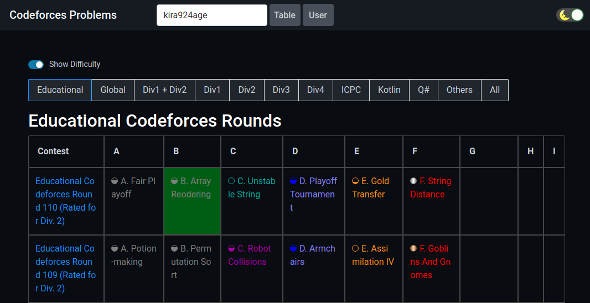

# CF Problems

[CF Problems](https://cf.kira924age.com) is a web application to manage your Codeforces Problems.
It is written in TypeScript with React.

This application uses [Codeforces API](https://codeforces.com/apiHelp)

## Contribution

### Found a Bug?

If you found a bug in the source code, you can help us by submitting an issue to our GitHub Repository.

### Missing a Feature?

You can request a new feature by submitting an issue to our GitHub Repository.

## Links

* [Codeforces](https://codeforces.com/)
* [kenkoooo/AtCoderProblems](https://github.com/kenkoooo/AtCoderProblems)
* [iilj/yukicoder-problems](https://github.com/iilj/yukicoder-problems)

